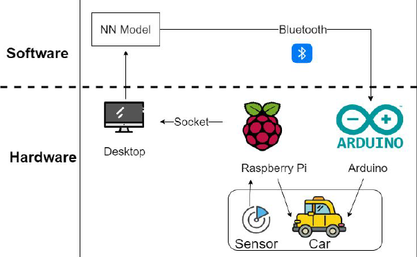
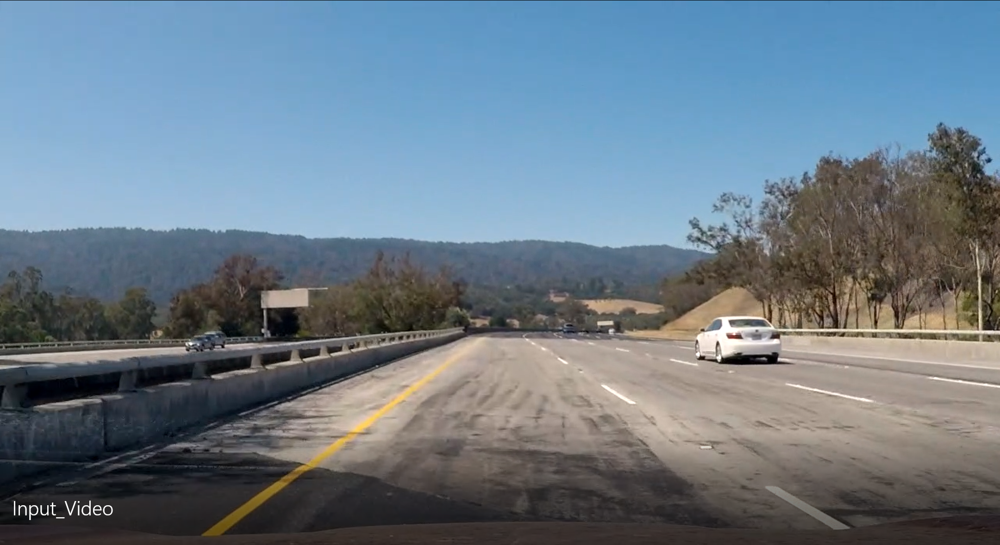
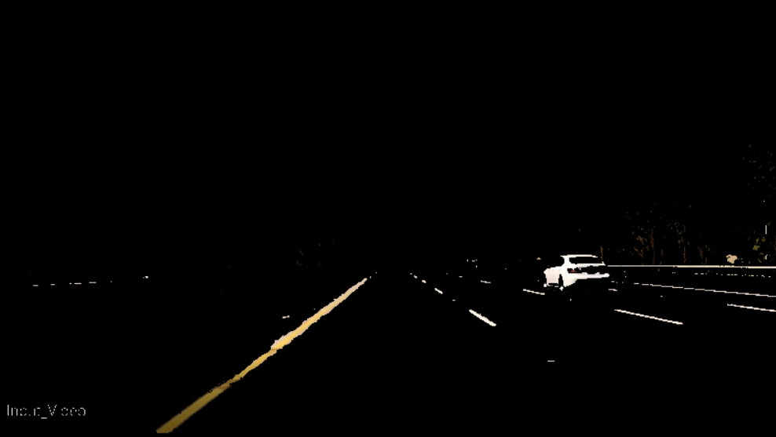
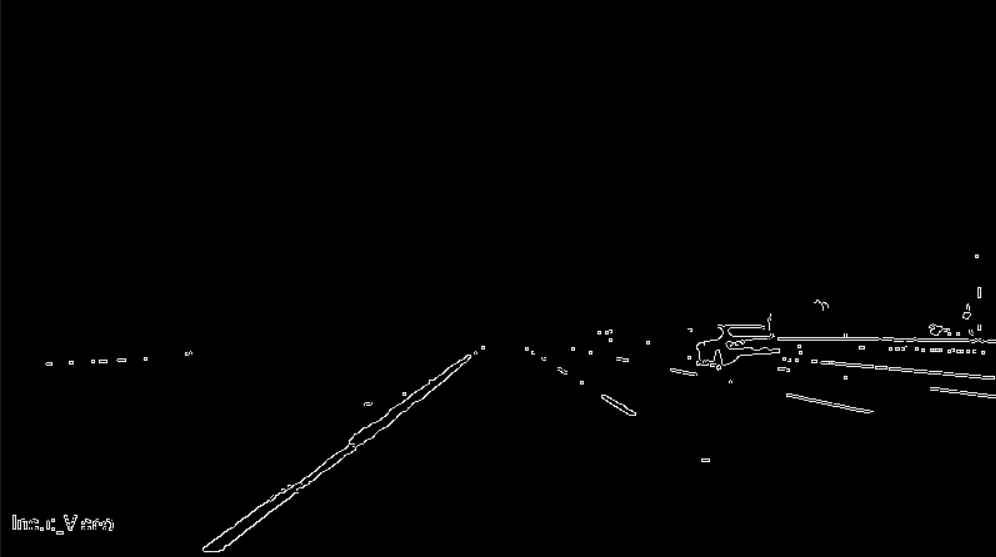
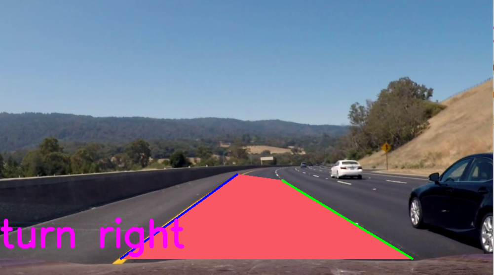

# Autonomous Remote Control Car

## Background
Use obstacle recognition to avoid collision is an important driving assistance technology. Existing methods use single sensor (LiDAR/camera). They have higher complexity and more detection flaws. We plan to build an autonomous RC car that uses distance sensors like LiDAR to avoid obstacles.It also uses OpenCV models to detect lanes so that the car can keep going in lane. This multi-model methods can ensure more accurate lane recognition and collisions avoiding, which is more practical.

## Architecture

## Development environment
1.  Python3
2.  OpenCV

## Introduction
In terms of software, we currently use OpenCV to recognize lane lines in videos. We first extract the yellow and white regions because the main colors of the lane lines are yellow and white. On the basis of these regions, use the edge extraction method and retain the region of interest, so that we can get the grayscale image shown in the second video. Then we fit the straight line in the area to obtain the lane line. Combined with information such as slope, we adjust the driving state of the vehicle (turn left, turn right and go straight), so that we get the first video.

## Current running results

__Original Graph:__

__Color Reserved:__

__Gray Graph:__

__Draw lanes:__

